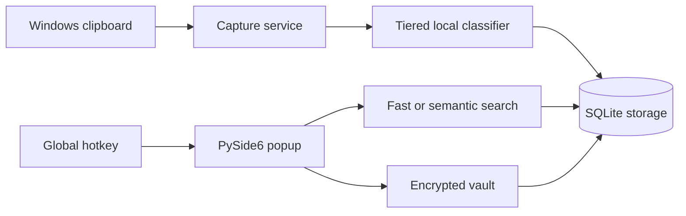

# Clippy

<p align="center">
  
</p>

<p align="center">
  A private, local-first clipboard manager for Windows 11 with deterministic classification,
  offline semantic search, risk warnings, and an encrypted vault.
</p>

<p align="center">
  <a href="https://github.com/MohammedYessineKraiem/Clippy">Repository</a> ·
  <a href="https://github.com/MohammedYessineKraiem/Clippy/releases">Releases</a> ·
  <a href="LICENSE">MIT License</a>
</p>

Clippy captures copied text, classifies it into useful sections, and makes clipboard history
searchable from a compact keyboard-driven popup. Clipboard data, settings, embeddings, and vault
contents stay on the machine. The application contains no cloud integration, telemetry, HTTP
client, or runtime model downloader.

The default global hotkey is **Ctrl+Alt+V**.

## Install and use the Windows executable

The packaged release is a portable Windows executable. It does not require Python or a separate
model installation.

1. Open the [Clippy Releases page](https://github.com/MohammedYessineKraiem/Clippy/releases).
2. Download `Clippy.exe` from the latest release. If no release is published yet, follow
   [Build the executable](#build-the-executable) below.
3. Optionally compare the file's SHA-256 hash with the hash in the release notes:

   ```powershell
   Get-FileHash .\Clippy.exe -Algorithm SHA256
   ```

4. Launch `Clippy.exe`. The first launch can take a few seconds while the single-file package
   initializes its local runtime and embedding model.
5. Copy text normally, then press **Ctrl+Alt+V** to open Clippy near the cursor.

The release may be unsigned, so Windows can show an unknown-publisher warning. Verify the hash and
confirm that the executable came from this repository before allowing it to run.

Clippy stays in the background when the popup is dismissed. Open **Config → Quit Clippy** to stop
the application completely. Quit Clippy before replacing or rebuilding the executable; Windows
cannot overwrite an executable that is still running.

## Everyday controls

| Action | Control |
| --- | --- |
| Open or close the popup | `Ctrl+Alt+V` |
| Dismiss the popup | Hotkey again, `Escape`, X, or click outside |
| Select one entry | Single-click |
| Select a range | Drag between rows or Shift-click from an anchor |
| Toggle individual entries | Ctrl-click |
| Copy and dismiss | Double-click a row or select one row and press `Enter` |
| Merge selected entries | Select multiple rows, then **Copy merged** |
| Compare entries | Select exactly two rows, then **Compare 2** |
| Move the popup | Drag its title bar |
| Resize the popup | Drag any edge, corner, or the lower-right grip |
| Stop the background process | **Config → Quit Clippy** |

The global hotkey, sound cues, semantic search, window behavior, section order, section visibility,
expiry rules, and vault timeout are configurable.

## Features

- Captures text clipboard changes while skipping an immediately repeated value.
- Keeps every entry in **All** and assigns at most one additional classified section.
- Provides Fast substring/fuzzy search and optional meaning-only Semantic search.
- Supports search operators such as `section:`, `before:`, `after:`, `today`, and `yesterday`.
- Includes deterministic sections for API keys, URLs, email and IP addresses, directories, JSON,
  SQL, Python, JavaScript/TypeScript, Java, configuration, Markdown, commands, errors, and logs.
- Uses local semantic examples for Passwords, App names, general Code, and custom semantic sections.
- Includes a permanent offline Malicious warning section for risky commands, suspicious URLs,
  executable downloads, obfuscation, and user-listed domains or sources.
- Supports custom sections, priorities, deterministic patterns, semantic examples, and expiry.
- Pins entries, previews long text, merges selections, and displays a neon side-by-side diff.
- Opens safe HTTP(S) URLs and reveals detected paths in Explorer through explicit row actions.
- Encrypts opted-in Vault text and embeddings at rest.
- Ships as a self-contained PyInstaller executable with the local ONNX model and app logo.

Clippy never executes clipboard text. Copied commands and code are classified and displayed only.

## Classification and search

Classification stops at the first confident match:

1. Local risk rules flag destructive or obfuscated commands, suspicious URL structures,
   executable downloads, and user-listed domains or sources.
2. Structural rules detect secrets, URLs, email addresses, IP addresses, and paths.
3. Syntax rules detect code, structured data, configuration, commands, errors, and logs.
4. Local semantic examples classify remaining entries into semantic sections. Entries below the
   confidence threshold remain in **All** only.

Deterministic sections use conservative signatures instead of semantic guesses. Semantic sections
compare against the closest curated example while retaining a confidence threshold. Classification
is still heuristic: genuinely ambiguous text cannot be guaranteed to classify perfectly.

The **Malicious** section cannot be hidden, moved, renamed, or deleted. Its editor accepts local
additions such as:

```text
domain:bad.example
url:https://example.test/download
source:Unknown Publisher
keyword:suspicious marker
re:custom-pattern
```

A risk match means **review before trusting**, not a definitive malware diagnosis. Flagged URLs do
not expose the Open URL action. Clippy never contacts online reputation services.

Search has two mutually exclusive modes:

- **Fast**: substring, token, and typo-tolerant matching.
- **Semantic**: meaning-only ranking with the bundled local MiniLM embedding model.

Operators work in either mode and can be combined:

```text
section:python-code model loader after:2026-08-01
yesterday report
before:tuesday section:directories .bak
```

Every custom section automatically receives a `section:<slug>` operator.

## Encrypted vault

The Vault uses a PBKDF2-derived Fernet key. Both entry text and its cached embedding are encrypted
at rest. The passphrase and derived key are never written to disk; the key exists only in process
memory while the vault is unlocked.

The default timeout locks the vault one minute after the last vault activity. Set it to zero to
keep the vault unlocked until the explicit **Lock** button is used.

Losing the passphrase means losing access to vault contents. There is no recovery service or cloud
copy.

## Implementation overview



| Area | Implementation |
| --- | --- |
| Clipboard capture | Background polling with `pyperclip`, duplicate suppression, and capture guards |
| Desktop UI | PySide6 frameless popup, responsive rows, global focus dismissal, and Qt animations |
| Global hotkey | `pynput` listener bridged safely onto the Qt event loop |
| Storage | Local SQLite database in WAL mode with typed storage models |
| Classification | Immutable risk checks, structural regex, syntax rules, then semantic prototypes |
| Semantic model | `all-MiniLM-L6-v2` executed locally through CPU-only ONNX Runtime |
| Search | Parsed operators plus exclusive Fast or Semantic ranking |
| Vault | PBKDF2 key derivation and Fernet encryption; no plaintext key persistence |
| Packaging | PyInstaller single-file Windows executable with model, tokenizer, and logo |
| Network boundary | No application network client, cloud calls, telemetry, or runtime downloads |

The main runtime flow is deliberately small: capture, classify once, cache the embedding, store,
then search the cached data locally. No plugin layer or remote service is involved.

## Project structure

```text
Clippy/
├── src/clippy/
│   ├── app.py                 # Runtime composition and lifecycle
│   ├── capture.py             # Clipboard monitoring
│   ├── classification.py      # Tiered classifier
│   ├── risk_detection.py      # Permanent offline risk rules
│   ├── search.py              # Query parsing and ranking
│   ├── storage.py             # SQLite schema and persistence
│   ├── security.py            # Vault key handling and encryption
│   ├── config.py              # Local settings and resource paths
│   ├── audio.py               # Optional local sound cues
│   └── ui/                    # Popup, dialogs, diff, and theme
├── packaging/Clippy.spec      # PyInstaller release definition
├── resources/                 # Logo and repository assets
├── scripts/                   # Build and model-export tooling
├── tests/                     # Unit and offscreen Qt interaction tests
├── pyproject.toml             # Project metadata and pinned dependencies
└── LICENSE                    # MIT license
```

## Install and run from source

### Requirements

- Windows 11, 64-bit
- Python 3.11 or 3.12
- Git
- A local `all-MiniLM-L6-v2` snapshot containing `tokenizer.json`

Clone the repository and create an isolated environment:

```powershell
git clone https://github.com/MohammedYessineKraiem/Clippy.git
cd Clippy
py -3.11 -m venv .venv
.venv\Scripts\Activate.ps1
python -m pip install --upgrade pip
python -m pip install -e ".[dev]"
```

Place the previously obtained model snapshot here:

```text
models/all-MiniLM-L6-v2/
├── tokenizer.json
└── model.onnx
```

If the snapshot has model weights but no `model.onnx`, export it once with the development tool:

```powershell
python scripts\export_model.py models\all-MiniLM-L6-v2
```

The exporter reads a local snapshot; it does not download a model.

Point the source run at that directory and launch Clippy:

```powershell
$env:CLIPPY_MODEL_PATH = (Resolve-Path "models\all-MiniLM-L6-v2")
clippy
```

A development checkout without the model starts in an explicitly announced degraded mode. Rule
classification still works, but semantic classification and search are unavailable.

## Build the executable

Install the development dependencies and prepare the model as described above. Make sure no
existing `dist\Clippy.exe` process is running, then execute:

```powershell
.\scripts\build.ps1
```

The build script:

1. Verifies that the local model directory exists.
2. Runs the complete test suite.
3. Performs a clean PyInstaller build.
4. Writes the self-contained executable to `dist\Clippy.exe`.

The build is offline and must run on Windows to produce a Windows executable.

### Release contents versus development tools

| Ships inside `Clippy.exe` | Development only |
| --- | --- |
| `src/clippy` application modules | `tests/` |
| ONNX model and tokenizer | Model export tooling |
| Clippy logo and executable icon | Implementation plan |
| Python/Qt runtime dependencies | Ruff, pytest, PyInstaller configuration, build scripts |

## Tests and quality checks

```powershell
python -m pytest
python -m ruff check src tests packaging
python -m compileall -q src tests
```

The suite covers classification precision and false positives, risk rules, storage migrations,
search modes and operators, encrypted vault behavior, expiry, platform actions, responsive UI
states, dialog lifecycle, real mouse double-click activation, and drag-range selection. Qt tests
run with the offscreen platform plugin; final hotkey and focus behavior should also be checked on a
real Windows desktop.

## Local data and privacy

Runtime files are stored under:

```text
%LOCALAPPDATA%\Clippy\
├── clippy.db
├── config.json
└── clippy.log
```

For isolated development, set `CLIPPY_DATA_DIR` to another directory. Local databases, model
weights, vault data, environment files, build output, and secrets are excluded by `.gitignore`.

Clippy supports text only. It does not sync, capture images or files, mask passwords, execute code,
run commands, or make network requests under any setting.

## Troubleshooting

- **The popup does not open:** another application may own the hotkey. Open Config and choose a
  different binding, then ensure only one Clippy instance is running.
- **Clippy appears to have closed but remains running:** dismissing the popup keeps capture active.
  Use **Config → Quit Clippy** to stop the process.
- **The build reports `Access is denied` for `dist\Clippy.exe`:** quit the currently running Clippy
  process before rebuilding.
- **Semantic mode is unavailable in a source checkout:** verify `CLIPPY_MODEL_PATH`, `model.onnx`,
  and `tokenizer.json`.
- **The vault locked:** unlock it with the original passphrase. There is intentionally no recovery
  mechanism and no persisted plaintext key.
- **A risk warning is incorrect:** treat it as a review signal, then adjust the custom Malicious
  list or deterministic section patterns from Config.

## Contributing

Issues and focused pull requests are welcome at
[github.com/MohammedYessineKraiem/Clippy](https://github.com/MohammedYessineKraiem/Clippy).
Keep changes local-first, preserve the no-execution/no-network boundaries, and include tests for
classification or interaction changes.

## Visual and audio identity

Clippy uses a near-black panel, violet hairline borders, restrained magenta focus states, monospace
clipboard content, and short eased motion. Opening expands from the cursor and closing contracts
like a small machine shutter. Four synthetic cues cover capture, open, close, and copy confirmation.
Sound is opt-in and disabled on first launch.

## License

Clippy is available under the [MIT License](LICENSE).
